# TUGAS 1

**Bintang Pradana Erlangga Putra - M0518010**

------


## 1. Michael Sipser no. 1.6. e (halaman 84)

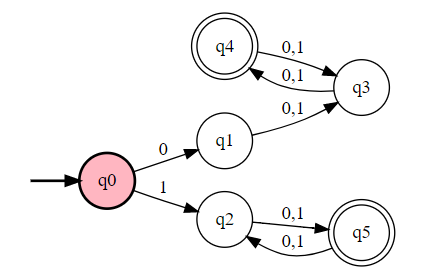

|  δ   |  0   | 1   |
| :--: | :--: | :--: |
|  q0  |  q1  |  q2  |
|  q1  |  q3  |  q3  |
|  q2  |  q5  |  q5  |
|  q3  |  q4  |  q4  |
|  *q4  |  q3  |  q3  |
|  *q5  |  q2  |  q2  |


## 2. NFA ke DFA untuk kasus Chess Board

### NFA

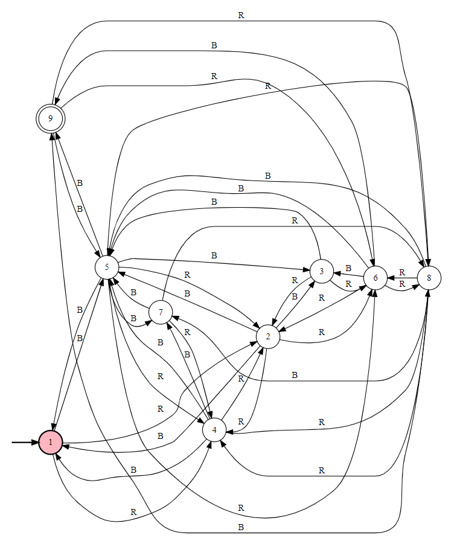

|  δ   |     R      |     B      |
| :--: | :--------: | :--------: |
|  1   |    2, 4    |     5      |
|  2   |    4, 6    |  1, 3, 5   |
|  3   |    2, 6    |     5      |
|  4   |    2, 8    |  1, 5, 7   |
|  5   | 2, 4, 6, 8 | 1, 3, 7, 9 |
|  6   |    2, 8    |  3, 5, 9   |
|  7   |    4, 8    |     5      |
|  8   |    4, 6    |  5, 7, 9   |
|  *9  |    6, 8    |     5      |

### DFA

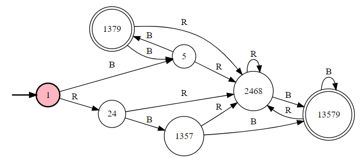

|        δ         |      R       |        B        |
| :--------------: | :----------: | :-------------: |
|        1         |    {2, 4}    |        5        |
|      {2, 4}      | {2, 4, 6, 8} |  {1, 3, 5, 7}   |
|        5         | {2, 4, 6, 8} |  {1, 3, 7, 9}   |
|   {2, 4, 6, 8}   | {2, 4, 6, 8} | {1, 3, 5, 7, 9} |
|   {1, 3, 5, 7}   | {2, 4, 6, 8} | {1, 3, 5, 7, 9} |
|  *{1, 3, 7, 9}   | {2, 4, 6, 8} |        5        |
| *{1, 3, 5, 7, 9} | {2, 4, 6, 8} | {1, 3, 5, 7, 9} |


## 3. NFA untuk pembagian 23

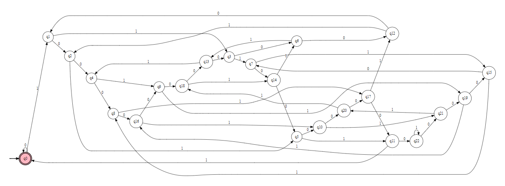

|  δ   |  0   |  1   |
| :--: | :--: | :--: |
| *q0  |  q0  |  q1  |
|  q1  |  q2  |  q3  |
|  q2  |  q4  |  q5  |
|  q3  |  q6  |  q7  |
|  q4  |  q8  |  q9  |
|  q5  | q10  | q11  |
|  q6  | q12  | q13  |
|  q7  | q14  | q15  |
|  q8  | q16  | q17  |
|  q9  | q18  | q19  |
| q10  | q20  | q21  |
| q11  | q22  |  q0  |
| q12  |  q1  |  q2  |
| q13  |  q3  |  q4  |
| q14  |  q5  |  q6  |
| q15  |  q7  |  q8  |
| q16  |  q9  | q10  |
| q17  | q11  | q12  |
| q18  | q13  | q14  |
| q19  | q15  | q16  |
| q20  | q17  | q18  |
| q21  | q19  | q20  |
| q22  | q21  | q22  |


## 4. Hopcroft, Motwani, Ullman Excercise 2.5.3 (halaman 79)

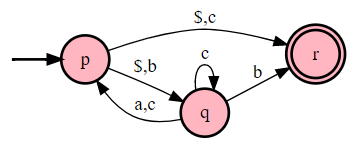

|  δ   |   ε    |  a   |  b   |   c    |
| :--: | :----: | :--: | :--: | :----: |
|  p   | {q, r} |  Ø   | {q}  |  {r}   |
|  q   |   Ø    | {p}  | {r}  | {p, q} |
|  *r  |   Ø    |  Ø   |  Ø   |   Ø    |

### 4.a. Excercise 2.5.3.a

$$
CL(p)=\{p,q,r\}\\
CL(q)=\{q\}\\
CL(r)=\{r\}
$$

### 4.b. Excercise 2.5.3.b

$$
\{\epsilon,a,b,c,ba,bb,bc,ca,cb,cc,aaa,aac,aba,abb,baa,bab,bac,bca,bcb,bcc,caa,cab,cac,cba,cbb,cbc,caa,ccc\}
$$

### 4.c. Excercise 2.5.3.c

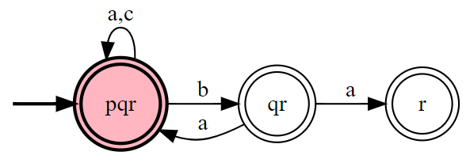

|     δ     |     a     |   b    |     c     |
| :-------: | :-------: | :----: | :-------: |
| {p, q, r} | {p, q, r} | {q, r} | {p, q, r} |
|  *{q, r}  | {p, q, r} |  {r}   | {p, q, r} |
|   *{r}    |     Ø     |   Ø    |     Ø     |

### 4.d. Konversi ke dalam bentuk NFA yang ekuivalen

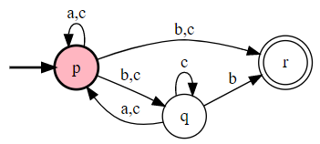

|  δ   |  a   |  b   |    c    |
| :--: | :--: | :--: | :-----: |
|  p   |  p   | q, r | p, q, r |
|  q   |  p   |  r   |  p, q   |
|  r   |  Ø   |  Ø   |    Ø    |


## 5. Hopcroft, Motwani, Ullman (halaman 91)

### 5.a. Excercise 3.1.2.b

#### DFA

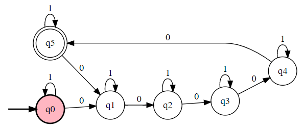

|  δ   |  0   |  1   |
| :--: | :--: | :--: |
|  q0  |  q1  |  q0  |
|  q1  |  q2  |  q1  |
|  q2  |  q3  |  q2  |
|  q3  |  q4  |  q3  |
|  q4  |  q5  |  q4  |
| *q5  |  q1  |  q5  |

#### Regular Expression

```(1*01*01*01*01*01*)*```

> Bukan merupakan konversi dari DFA di atas tetapi akan memberikan hasil yang sama

### 5.b. Excercise 3.1.3.b

#### DFA

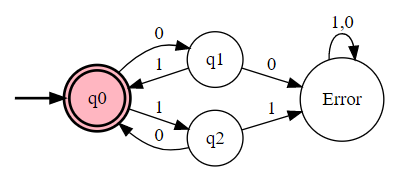

|   δ   |   0   |   1   |
| :---: | :---: | :---: |
|  *q0  |  q1   |  q2   |
|  q1   | Error |  q0   |
|  q2   |  q0   | Error |
| Error | Error | Error |

#### Regular Expression

```((01)*(10)*)*```

> Bukan merupakan konversi dari DFA di atas tetapi akan memberikan hasil yang sama

### 5.c. Excercise 3.1.3.c

#### DFA

##### DFA Accept 0's Divisible by 5

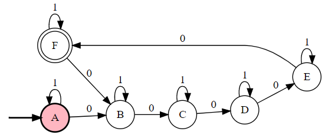

##### Accept Even 1's

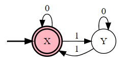

##### Cross Product of Two DFAs

$$
\{A,B,C,D,E,F\}\times\{X,Y\}\\
=\{AX,AY,BX,BY,CX,CY,DX,DY,EX,EY,FX,FY\}
$$

|  δ   |  0   |  1   |
| :--: | :--: | :--: |
|  AX  |  BX  |  AY  |
|  AY  |  BY  |  AX  |
|  BX  |  CX  |  BY  |
|  BY  |  CY  |  BX  |
|  CX  |  DX  |  CY  |
|  CY  |  DY  |  CX  |
|  DX  |  EX  |  DY  |
|  DY  |  EY  |  DX  |
|  EX  |  FX  |  EY  |
|  EY  |  FY  |  EX  |
| *FX  |  BX  |  FY  |
|  FY  |  BY  |  FX  |

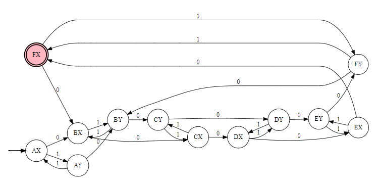

#### Regular Expression

```belum ketemu regex-nya```

> Izin bertanya bu, apakah ada operasi yang ekuivalen dengan cross product DFA tetapi pada Regular Expression?


## 6. Hopcroft, Motwani, Ullman (halaman 92)

### 6.a. Excercise 3.1.4.b

Himpunan substring ...

### 6.b. Excercise 3.1.4.c

Himpunan substring dengan setidaknya satu 0 diikuti 10, dan diikuti oleh nol atau lebih 1


## 7. Hopcroft, Motwani, Ullman Problem 3.4.3 (halaman 122)

```(0+1)*1(0+1)+(0+1)*1(0+1)(0+1)```


## 8. Hopcroft, Motwani, Ullman Problem 3.5. no c, e, dan f (halaman 124)

### 8.a. Problem 3.5.c

```(R*S*)*=(R+S)*``` **TRUE** karena 

### 8.b. Problem 3.5.e

### 8.c. Problem 3.5.f


## 9. Michael Sipsers no 1.5.1.c dan 1.5.2 (halaman 91)

### 9.a. 1.5.1.c

### 9.b. 1.5.2


## 10. Hopcroft, Motwani, Ullman Excercise 4.4.1 dan 4.4.2. (halaman 165)

### 10.a. 4.4.1.

### 10.b. 4.4.2

